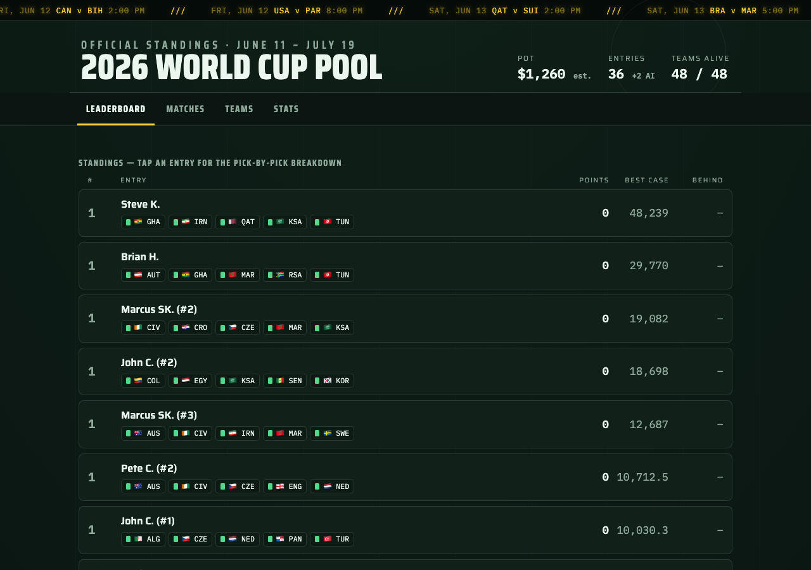

# 2026 World Cup Pool Tracker

A zero-backend static site tracking a 38-entry World Cup pool: live leaderboard
with best-case ceilings, match tracker with "who has skin in this game" stakes,
all 48 teams with their multiples, and pool stats. One HTML file, vanilla JS,
no build step — all scoring math runs in the browser from a single `data.json`.



## How it works

```
┌──────────────┐  poll: cron every 30 min,      ┌────────────────────┐
│ ESPN public  │  60 s loop while matches live  │   GitHub Action    │
│  scoreboard  │ ◀───────────────────────────── │  update_results.py │
└──────────────┘                                └─────────┬──────────┘
                                                          │ commit + Pages
                                                          │ rebuild, only
                                                          ▼ on change
                       ┌──────────────┐  serves   ┌─────────────┐
   viewers ◀────────── │ GitHub Pages │ ◀──────── │  data.json  │
   (index.html         └──────────────┘           │ "the entire │
    refetches data.json                           │   backend"  │
    every 60 s)                                   └─────────────┘
```

There is no server. `data.json` is the database, a GitHub Action is the
backend, and GitHub Pages is the host — updating the file *is* the deploy.
Viewers see score changes roughly 1–2.5 minutes behind real time (poll
interval + Pages redeploy).

## The pool

Each entrant paid $35 and picked **5 countries**. Every tournament achievement
banks points, multiplied by the country's *multiple* (longshots are worth more
— set from championship odds when entries closed):

| Achievement            | Points |
| ---------------------- | -----: |
| Advance from group     |      3 |
| Round-of-32 win        |     10 |
| Round-of-16 win        |     10 |
| Quarterfinal win       |     25 |
| Semifinal win          |     50 |
| Third-place match win  |     25 |
| Final win              |    100 |

Entry score = Σ (achievement points × that team's multiple). Payouts: 50 / 35 /
15 % of the pot. Two exhibition AI entries (ChatGPT, Gemini) appear on the
leaderboard but are excluded from ranks, payouts, and the pot.

## Repo map

| File | Role |
| --- | --- |
| `index.html` | The entire app — CSS, markup, JS. Embedded `DEFAULT_DATA` fallback for offline/local viewing. |
| `data.json` | Single source of truth: `meta`, `teams`, `status`, `entries`, `matches`, `probs`. |
| `scripts/update_results.py` | Stdlib-only ESPN poller; rewrites `matches` + `status` + `probs` only. |
| `scripts/probs.py` | Market-implied probabilities: DraftKings match lines (via ESPN) + Polymarket title odds → Monte Carlo of the remaining bracket → the leaderboard's "Proj" column. |
| `scripts/import_entries.py` | Imports entries from the commissioner's `.xlsx`; updates `data.json` and `DEFAULT_DATA`. |
| `.github/workflows/update-results.yml` | Two-speed poller (30-min cron; 60 s loop during matches). |
| `OPERATIONS.md` | Commissioner runbook: manual scoring, automation notes, recovery. |
| `TODO.md` | Backlog. |

## Local preview

```bash
python3 -m http.server 8000    # then open http://localhost:8000
```

Opening `index.html` directly also works — it falls back to the embedded data,
so use a local server (or the live site) to see the real `data.json`.

## Operating the pool

Everything the commissioner needs — the manual-scoring vocabulary (the
achievement-code reference), how the automation behaves and fails, importing
late entries, and the end-of-tournament freeze — lives in
[OPERATIONS.md](OPERATIONS.md).
